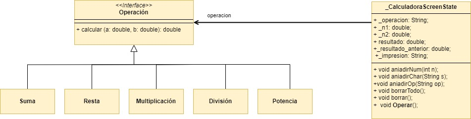
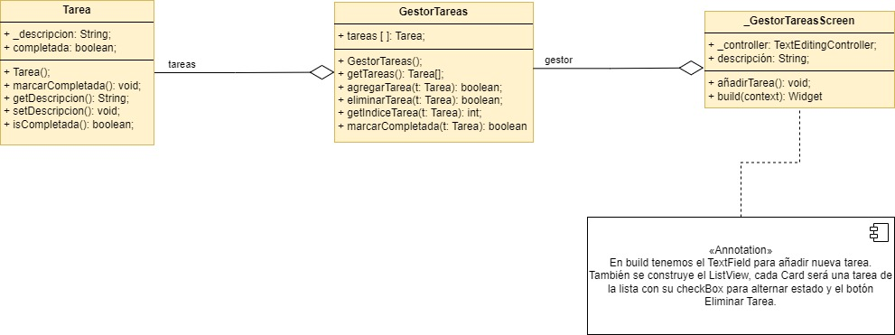

## Ejercicio Individual 1: Simulación de una Calculadora

Este ejercicio consiste en desarrollar una calculadora que permita al usuario realizar diversas operaciones matemáticas. La interfaz de usuario (UI) solicitará al usuario que introduzca la operación a realizar y dos números. El resultado de la operación se mostrará en la misma interfaz de usuario.

### Detalles de la Implementación
- Se implementarán diferentes operaciones matemáticas como suma, producto, potencia, etc.
- Cada operación será una clase que heredará de la clase base `Operacion`.
- El usuario interactuará con la interfaz de usuario (UI) para ingresar la operación y los dos números.
- El modelo calculará el resultado de la operación y lo mostrará en la UI.

### Diagrama UML

## Ejercicio Individual 2: Gestión de Tareas con Flutter

En este ejercicio, desarrollaremos una aplicación en Flutter que permita a los usuarios gestionar una lista de tareas. Cada tarea podrá ser marcada como completada o pendiente, y el usuario tendrá la capacidad de agregar nuevas tareas y eliminar las existentes.

### Detalles de la Implementación
- Se crearán las clases `Tarea` y `GestorDeTareas`.
- La clase `Tarea` contendrá al menos dos atributos: `descripcion` (String) y `completada` (bool).
- La clase `GestorDeTareas` contendrá una lista de objetos `Tarea` y métodos para agregar, eliminar y marcar tareas como completadas.
- La interfaz de usuario incluirá un TextField para ingresar la descripción de la nueva tarea, un botón para agregar la tarea a la lista y un widget ListView para mostrar la lista de tareas.
- Cada tarea en la lista mostrará visualmente si está completada o pendiente.
- Al marcar una tarea como completada, cambiará visualmente en la lista.
- Al eliminar una tarea, desaparecerá de la lista.

### Diagrama UML

